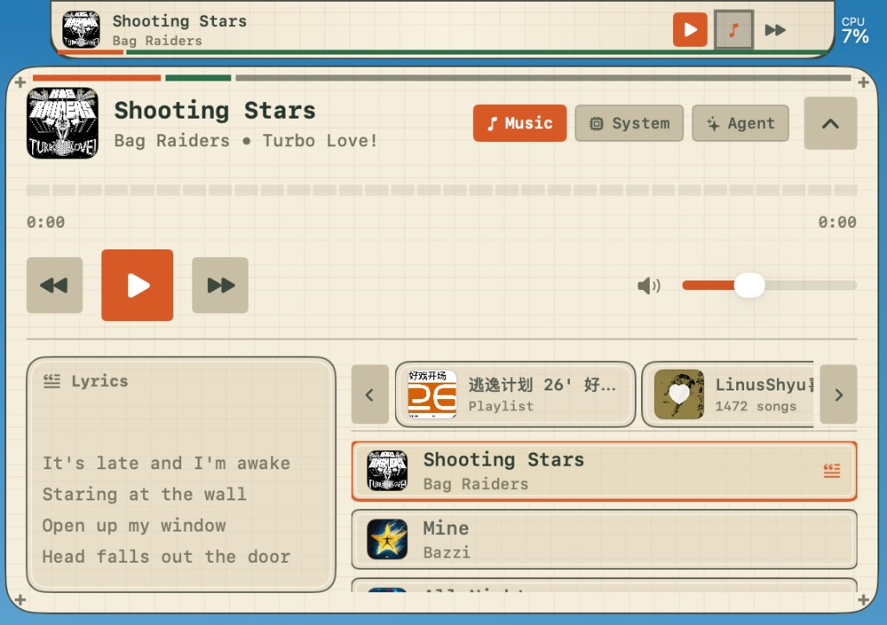
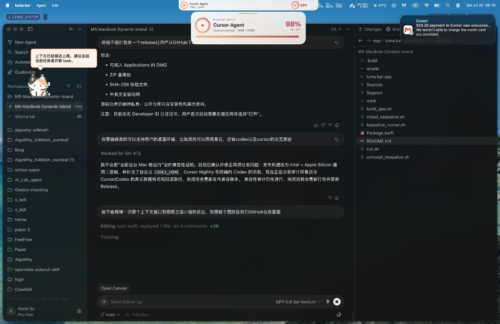

# Luma Bar — Downloads

> A living workspace around your MacBook notch.

Luma Bar is a native macOS Dynamic Island that combines music and synchronized lyrics, a context-aware local AI agent, system monitoring, task completion notifications, voice input, and desktop pets.

## 中文安装说明

1. 前往 [Releases](https://github.com/Linus-Shyu/Luma-Bar-Download/releases/latest) 下载 `Luma-Bar-v0.1.0-arm64.dmg`。
2. 打开 DMG。
3. 将 **Luma Bar** 拖入 **Applications** 文件夹。
4. 首次启动时，在“应用程序”中右键 Luma Bar 并选择“打开”。
5. 根据需要授予辅助功能、麦克风、语音识别、自动化或通知权限。

当前 Beta 版本适用于 Apple Silicon Mac，要求 macOS 14 或更高版本。

## Installation

1. Open the [latest Release](https://github.com/Linus-Shyu/Luma-Bar-Download/releases/latest) and download `Luma-Bar-v0.1.0-arm64.dmg`.
2. Open the DMG.
3. Drag **Luma Bar** into **Applications**.
4. On first launch, right-click Luma Bar in Applications and choose **Open**.
5. Grant only the macOS permissions required by the features you use.

This beta build supports Apple Silicon Macs running macOS 14 or later.

## Why the first-launch right click?

The current beta is signed with an Apple Development certificate but is not yet notarized with a Developer ID certificate. macOS Gatekeeper may therefore require the one-time right-click **Open** flow. A notarized build will remove this extra step in a future release.

## Screens

### Music, playlists, and synchronized lyrics

### System monitoring and contextual desktop pet

### Cursor context at the limit

When Cursor or Codex approaches the context-window ceiling, the notch expands into a live usage gauge and the desktop pet warns you before the session collapses.

## Privacy

Luma Bar is local-first. Model-provider API keys stay in macOS Keychain. Recent local-operation context expires automatically, and remote model requests are only sent when you invoke a feature that needs the selected provider.

## Source availability

This repository distributes release binaries and documentation only. The source repository remains private.

`#adventurex2026`
